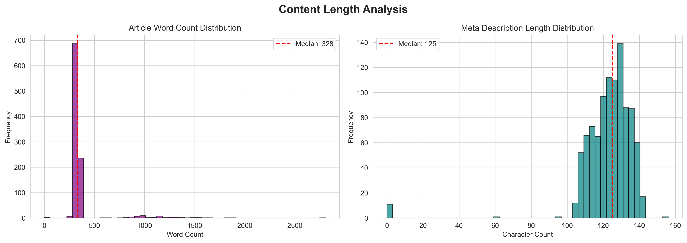
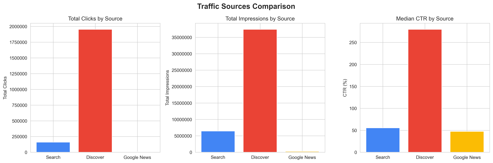
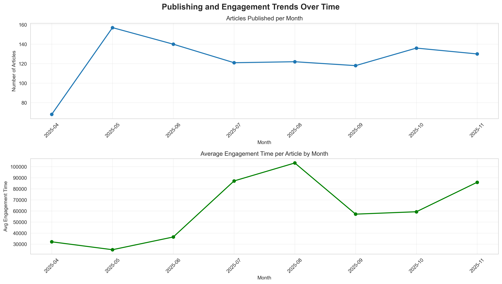

# hnn-textanalysis
This repo is dedicated to a series of scripts meant to enrich a CSV of analytics on Sneakers articles written on Hot New Hip Hop. At a high level, the program scrapes content from HNNH, analyzes the text with GPT, creates embeddings and builds a neural network (intended) to predict the # of views an article will get in it's first 7 days of being published.

It's important to note this project was a fantastic oppurtunity to practice working with a non-technical partner to help transform their business requirements to technical needs.

**tldr:** Skip to [here](##Demo-/-Code-Explanation:) to see me demo

#### The pipeline:
1. Crawl and extract my roommate's articles (Ben Atkinson) from the company's webpage using the **Firecrawl API** and URLs in the provided CSV
2. The content is then processed with GPT to generate some basic features like the article type and shoe brand mentioned. Further, some text attributes are calculated (number of paragraphs, article length, etc.). Embeddings are also created.
3. Using PyTorch a Neural Network is then trained, cross-validated and tested. 
4. The model is then exposed through a simple Streamlit app allowing a user to input an article and receive a prediction of the article's page views.

#### Visual modelling of dataflow:


---

## Objectives
- **Web Scraping & Ingestion**
  - Use Firecrawl API to crawl and extract article content from the web.
  - Clean the scraped data and format the text for downstream processing.
- **Data Engineering**
  - Combine scraped data to the provided CSV of analytics
  - Add additioanl features to the data set using OpenAI embeddings, GPT and basic Python computations.
  - Produce a structured dataset suitable for ML and exploratory analysis.
- **Machine Learning**
  - Apply ML techniques (informed by QTM-3635) to:
    - Predict artiicle performance/page views.
    - Identify which features matter most (e.g., text features, metadata, publish time).
- **Visualization / WebApp**
  - Build a simple dashboard/web app to make the model usable to a user seeking to 'optimize' their text.

---

## Data
The base dataset I was provided can be seen in the [hnnh_base.csv](data/hnnh_base.csv) I've also added a [data dictionary](data_dictionary.md). This is dataset shows the analytics for 992 sneaker articles written by my roommate Ben Atkinson between April 1st and now. The data was collected from an external data provider and shows the leading analytics for articles in the week after their publish date. In the first week after there publishing these articles have generated a cumulative 2,470,567 total page views averaging ~2490 viewers per article.

Each article is typically around 330 words and views come from three key sources, Google News, Google's Discovery and Search traffic.  Some visualizations of the data can be seen below.

E





Now since most of these analytics are derivatives of one another this project required me to enrich the dataset with features that may have some predictave correlation. Hence why I chose to scrape text content, calculate features on the text content, and add embeddings.

---

## Tech Stack

- **Language:** Python
- **Scraping:** Firecrawl API
- **Enrichment:** OpenAI APIs for LLM feature processing and embedding generation
- **Data / Analysis:** pandas, NumPy, scikit-learn
- **Modeling:** Neural Network through PyTorchar
- **Dashboard:** Streamlit

### Required APIs:
Users will need an [OpenAI](https://openai.com/api/pricing/) & [Firecrawl API](https://www.firecrawl.dev/pricing) key. 

The Firecrawl API can be used for free (with 500 limited credits) and has a promotional code for students to use up to 20,000 credits. Do note that if using the free tier for Firecrawl you will have to adjust `RATE_LIMIT_DELAY` in the [firecrawl_client](scripts/scraping/firecrawl_client.py) script. I've left a comment on line 72 to make this easy and left a few lines commented code in the main function for users to test the functions. 

---

## Explanation of Project Structure

```
.
├── data/
│   └── hnnh_base.csv             # Base CSV File to be enriched and GPT Processed. If interested in seeing scripts
│                                   run, delete all other CSVs
├── scripts/
│   ├── models/
│   │   │── feature_engineering.py       # Creating new features using OpenAI API and Python computations
│   │   │── prompts/
│   │   │   └── prompt1.py               # Prompt used to extract sneaker brand, article type
│   │   │                                  and sneaker price from article
│   │   │── model1.py                    # Python program using PyTorch to create and run a Neural Network
│   │   │                                  using the engineered features
│   │   └── EDA.ipynb                    # Jupyter notebook dedicated to Exploratory Data Analysis
│   └──scraping/
│       └── firecrawl_client.py   # Wrapper around Firecrawl API
│
├── app.py                        # Streamlit App exposing underlying Neural Network
├── data_dictionary.md            # Dictionary explaining the column headers of the base CSV
├── README.md
└── requirements.txt
```

## Step by Step on how to use these scripts:
Before running any programs begin by installing the requirements and creating a valid env using this provided [sample](.env.sample). And if you want to test the full data processing pipeline I reccomend you begin by deleting all CSVs other than [this CSV](data/hnnh_base.csv). 

### Script Execution:
1. Run [firecrawl_client.py](scripts/scraping/firecrawl_client.py) to enrich the base csv with text scraped from the Hot New Hip Hop website. Depending on API tier this can take between 10 minutes and 1.5 hours. Remember to adjust `RATE_LIMIT_DELAY` on line 72.
2. Run [feature_eng.py](scripts/models/feature_eng.py) to use the text to create new features within the CSV like: Article Type, Sneaker Price and text embeddings. Some things to note:
    - If you just want to test the functionality of the sync functions against ten recrods you can run the file normally.
    - If you'd like to enrich the csv in it's entirety I reccomend running the parallelized functions which run against OpenAI's async endpoints. You can use run this bash command: `python scripts/models/feature_eng.py parallel` which runs the script with 50 concurrent requests being made to OpenAI's APIs. Rows that are failed to process will be saved to an error log under located at `data/gpt_processing_errors.csv`. This step should take about 5 minutes.
3. Train the Neural Network using [Model1.py](scripts/models/model1.py) and monitor the terminal outputs to see model statistics and cross validation results. Also feel free to adjust the model architecture by changing the constants between lines 14-18. 
   - **Important Note:** Please don't laugh at my R², I really did try. 
4. Launch the streamlit app by running `streamlit run app.py` in your terminal. And test out an article, I reccomend you **a)** stifle your expectations and **b)** grab an article from this [link](https://www.hotnewhiphop.com/articles/sneakers) that's about 7 days old, fill in the form fields and click predict.


**Note:** There is an EDA notebook which was 'read only', with none of the changes being saved to the HNHH_Processed.CSV. This script was used to generate the graphics above and guide initial modelling. The Model scripts can be run without having to use the Jupyter Notebook.

## Demo / Code Explanation:

[Demo of the Streamlit App](https://drive.google.com/file/d/174Fpiyz7w_hI9F35O-9lzdF_zU1ZmglT/view?usp=drive_link), Firecrawl usage and OpenAI calls are shown in this video. Had to cut the video short (and it's still long), so feel free to email if you have any questions. I reccommend watching at 1.25x speed. 


## Considering why this might not have worked?
If you've followed along so far, you may have noticed that the models generated by these scripts and data are functionally useless. With an `R² = 0.008`, the neural network is just about as good as guessing the median # of views. While disappointing, I'm not all that surprised. 

The articles are, for the most part, very similar in structure, primarily focus on Jordans, and views do tend to be driven more by the zeitgeist within sneakerhead subculture than by structural article attributes.

That said, I do think the cultural trends that determine what's in vogue can be turned into data. So, if redoing this project, some additional data I would consider bringing in for future analyses include:
- There are sneaker marketplaces that let bidders determine shoe prices (i.e., StockX). This data could be used to add a predictor covering the spread between a sneaker's anticipated retail price and a similar form's trading price.
- The X (formerly Twitter) API could be used to pull in and score sentiment or the volume of tweets discussing a specific sneaker in the days preceding a sneaker's release. This could help add a feature to the model indicating the momentum of social interest at the time of publishing. An example where this might work: After the UNH Healthcare assassination, an article related to the sneakers worn by a police officer involved in the case did incredibly well. There were tons of tweets on the topic before the article's publication. 


For notes on my AI Usage, look [here](ai_use.md)
